# Kubernetes Architecture — Detailed Technical Reference

This document goes beyond the high-level component list and explains **how each piece actually works internally** — the reconciliation pattern, request lifecycle, scheduler internals, kubelet internals, networking data path, storage provisioning, and security enforcement — with diagrams and example manifests.

---

## 1. The Core Pattern: Declarative Control Loops

Everything in Kubernetes is built on one repeating pattern, the **reconciliation loop**:

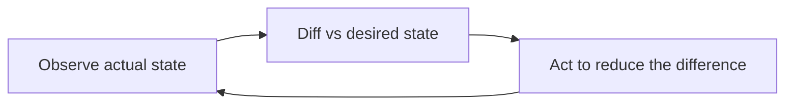

Every controller (Deployment controller, Node controller, ReplicaSet controller, custom controllers/operators) runs this loop independently and continuously, watching the API server for changes via **watch/list**, not polling in the traditional sense. This is what makes Kubernetes self-healing: if actual state drifts from desired state (a Pod crashes, a node dies), the relevant controller notices on its next reconcile and corrects it.

---

## 2. Full Architecture Diagram

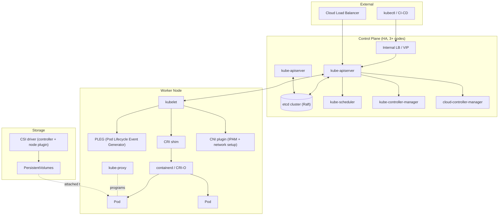

---

## 3. API Server: Request Lifecycle in Detail

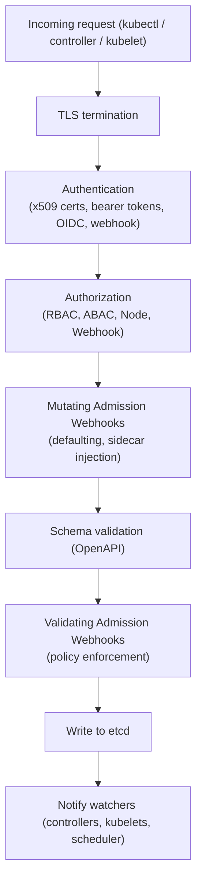

Every single write to the cluster — `kubectl apply`, a controller creating a Pod, a kubelet updating status — passes through this **exact same pipeline**. The API server is the only component allowed to talk to etcd directly; nothing else touches the datastore.

---

## 4. etcd Internals

- Stores data as a flat **key-value hierarchy**, e.g. `/registry/pods/default/my-pod`.
- Uses the **Raft consensus algorithm**: one leader, followers replicate the log; writes require majority acknowledgment (quorum).
- Odd node counts are used (3, 5, 7) to avoid split-brain and to tolerate `(n-1)/2` node failures.
- **Watch API**: clients (mainly the API server, then controllers/kubelets indirectly) subscribe to key changes instead of polling — this is the backbone of Kubernetes' event-driven design.
- Losing etcd quorum = losing the ability to read/write cluster state. Regular **snapshot backups** are critical.

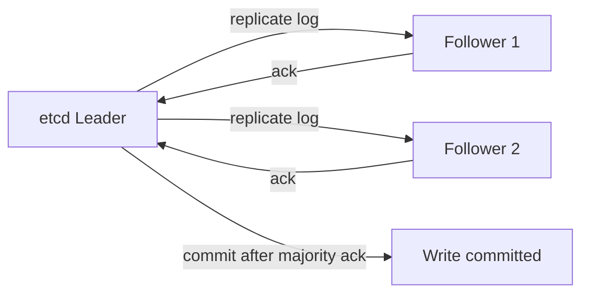

---

## 5. Scheduler Internals: Filtering + Scoring

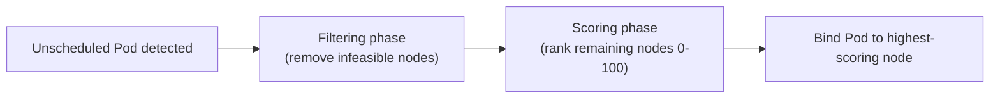

**Filtering (predicates)** — eliminates nodes that can't run the Pod at all:
- Insufficient CPU/memory/ephemeral-storage
- NodeSelector / node affinity mismatch
- Taints the Pod doesn't tolerate
- Port conflicts
- Volume zone/topology mismatch

**Scoring (priorities)** — ranks remaining feasible nodes:
- `LeastAllocated` / `MostAllocated` (bin-packing vs spreading)
- Pod (anti-)affinity satisfaction
- Node affinity preference weight
- Image locality (node already has the image cached)
- Spread across zones/topology domains

The scheduler is pluggable via the **Scheduling Framework** — custom filter/score plugins can be added without forking the scheduler.

**Example: influencing scheduling**
```yaml
affinity:
  nodeAffinity:
    requiredDuringSchedulingIgnoredDuringExecution:
      nodeSelectorTerms:
        - matchExpressions:
            - key: disktype
              operator: In
              values: ["ssd"]
  podAntiAffinity:
    preferredDuringSchedulingIgnoredDuringExecution:
      - weight: 100
        podAffinityTerm:
          labelSelector:
            matchLabels: {app: my-app}
          topologyKey: kubernetes.io/hostname
tolerations:
  - key: "dedicated"
    operator: "Equal"
    value: "gpu"
    effect: "NoSchedule"
```

---

## 6. kubelet Internals

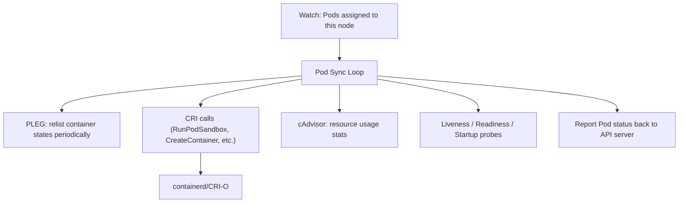

- **Pod Sync Loop**: for each Pod assigned to the node, kubelet continuously reconciles the running containers against the PodSpec.
- **PLEG (Pod Lifecycle Event Generator)**: periodically relists containers via the CRI to detect state changes (started, died) more efficiently than syncing every Pod every time.
- **CRI (Container Runtime Interface)**: gRPC API kubelet uses to talk to any compliant runtime (containerd, CRI-O) — decouples Kubernetes from any specific runtime implementation.
- **cAdvisor** (built into kubelet): collects container resource usage/performance metrics, feeding `kubectl top` (via Metrics Server) and eviction decisions.
- **Probes**:
  - *Liveness* — restarts the container if it fails.
  - *Readiness* — removes the Pod from Service endpoints if it fails (doesn't restart).
  - *Startup* — gates liveness/readiness checks until the app has finished starting.
- **Node-level eviction**: kubelet proactively evicts Pods under memory/disk pressure based on QoS class (`Guaranteed` > `Burstable` > `BestEffort`).

---

## 7. Pod Lifecycle (Phases & Container States)

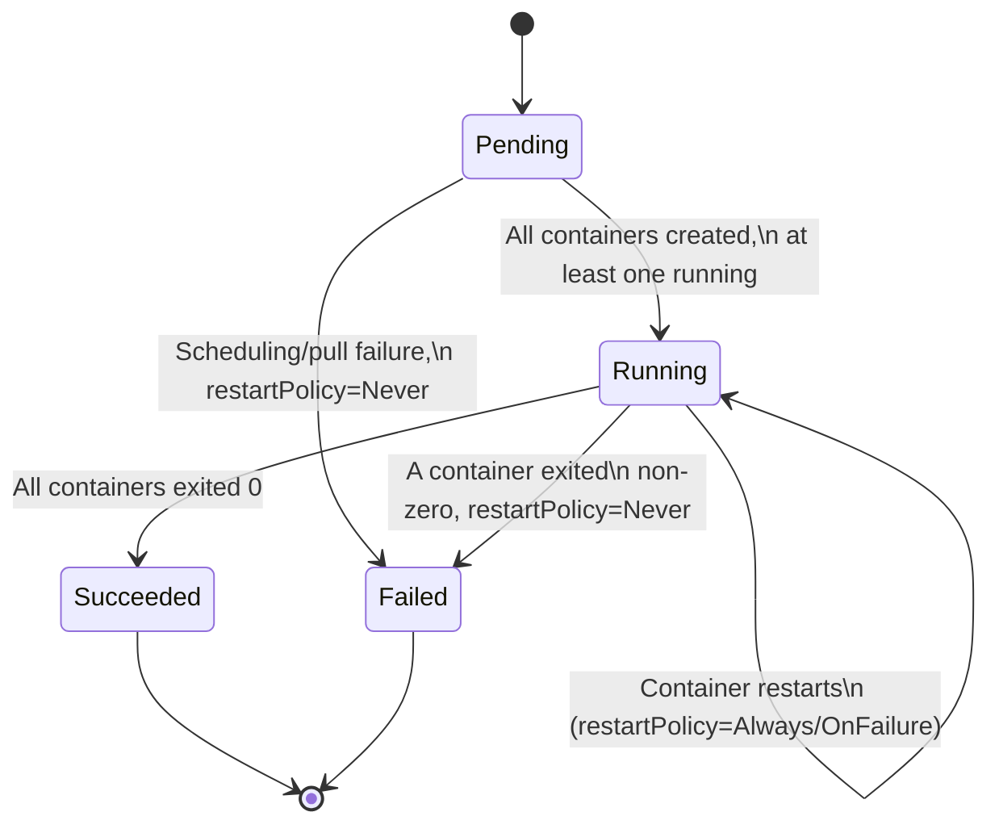

Container-level states within a Pod: `Waiting` → `Running` → `Terminated`, tracked independently per container.

**Termination sequence** when a Pod is deleted:
1. API server marks Pod as `Terminating`, sets `deletionTimestamp`.
2. kubelet sends `preStop` hook (if defined) to containers.
3. `SIGTERM` sent to container's main process.
4. Kubernetes waits up to `terminationGracePeriodSeconds` (default 30s).
5. `SIGKILL` sent if the container hasn't exited.
6. Pod object removed from etcd once containers are confirmed gone.

Simultaneously, kube-proxy removes the Pod's IP from Service endpoints as soon as it starts terminating, so no new traffic is routed to it.

---

## 8. Networking Deep Dive

### 8.1 CNI: Pod IP Assignment

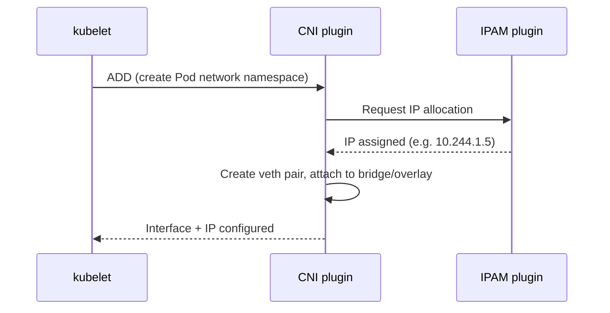

Kubernetes itself has no built-in networking implementation — it delegates entirely to whichever CNI plugin is installed (Calico, Cilium, Flannel, Weave). Two broad approaches:
- **Overlay networks** (VXLAN/IP-in-IP): encapsulate Pod traffic, works regardless of underlying network — simpler but adds overhead.
- **Native/BGP routing** (e.g., Calico in BGP mode): Pod IPs are routed directly at L3 — better performance, requires underlying network cooperation.
- **eBPF-based** (Cilium): bypasses iptables entirely, programs the Linux kernel directly for higher performance and richer policy (L3-L7).

### 8.2 kube-proxy: Service Implementation

| Mode | How it works | Notes |
|---|---|---|
| **iptables** (default historically) | Programs iptables DNAT rules per Service/Endpoint | O(n) rule evaluation, can get slow with many Services |
| **IPVS** | Uses Linux IPVS (Layer 4 load balancer in-kernel) | O(1) lookup via hash tables, better at scale |
| **eBPF (via Cilium, replacing kube-proxy)** | Uses eBPF programs for Service load-balancing | Best performance, most modern approach |

### 8.3 DNS Resolution Flow

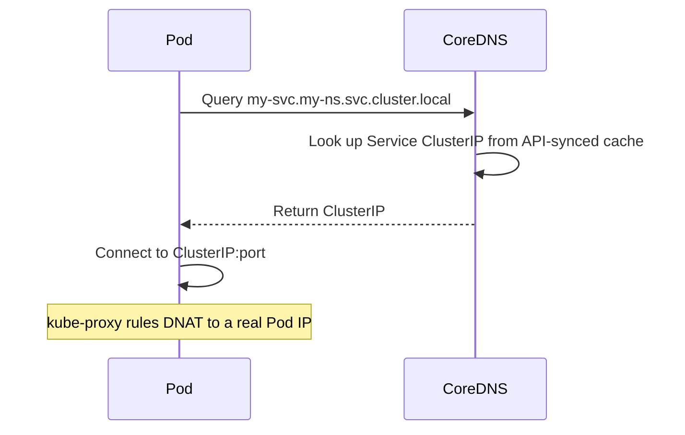

### 8.4 NetworkPolicy Example

```yaml
apiVersion: networking.k8s.io/v1
kind: NetworkPolicy
metadata:
  name: allow-frontend-to-backend
spec:
  podSelector:
    matchLabels: {app: backend}
  policyTypes: ["Ingress"]
  ingress:
    - from:
        - podSelector:
            matchLabels: {app: frontend}
      ports:
        - protocol: TCP
          port: 8080
```

Enforced entirely by the CNI plugin — Kubernetes just stores the policy object; it does nothing on its own without a policy-aware CNI.

---

## 9. Storage Deep Dive

### 9.1 Dynamic Provisioning Flow

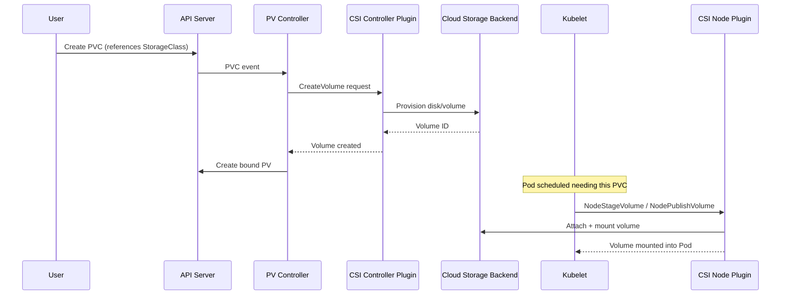

### 9.2 Access Modes

| Mode | Meaning |
|---|---|
| **ReadWriteOnce (RWO)** | Mounted read-write by a single node |
| **ReadOnlyMany (ROX)** | Mounted read-only by many nodes |
| **ReadWriteMany (RWX)** | Mounted read-write by many nodes (needs NFS/CephFS-like backend) |
| **ReadWriteOncePod (RWOP)** | Mounted read-write by a single Pod (newer, stricter than RWO) |

### 9.3 Reclaim Policies

- **Retain** — PV and underlying storage persist after PVC deletion (manual cleanup required).
- **Delete** — underlying storage is deleted when the PVC is deleted (default for most dynamic provisioners).

### 9.4 Example StorageClass + PVC

```yaml
apiVersion: storage.k8s.io/v1
kind: StorageClass
metadata:
  name: fast-ssd
provisioner: ebs.csi.aws.com
parameters:
  type: gp3
reclaimPolicy: Delete
volumeBindingMode: WaitForFirstConsumer
---
apiVersion: v1
kind: PersistentVolumeClaim
metadata:
  name: data-pvc
spec:
  accessModes: ["ReadWriteOnce"]
  storageClassName: fast-ssd
  resources:
    requests:
      storage: 20Gi
```

`volumeBindingMode: WaitForFirstConsumer` delays provisioning until a Pod actually needs the volume — ensures the volume is created in the same zone as the Pod's assigned node.

---

## 10. RBAC in Detail

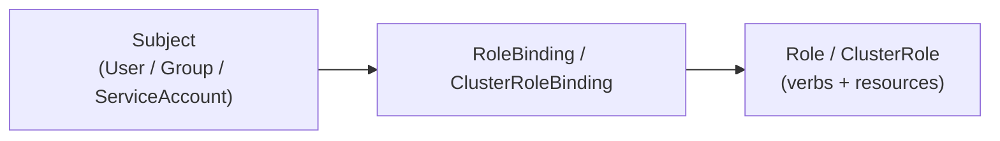

**Example: read-only access to Pods in one namespace**
```yaml
apiVersion: rbac.authorization.k8s.io/v1
kind: Role
metadata:
  namespace: dev
  name: pod-reader
rules:
  - apiGroups: [""]
    resources: ["pods"]
    verbs: ["get", "list", "watch"]
---
apiVersion: rbac.authorization.k8s.io/v1
kind: RoleBinding
metadata:
  name: read-pods
  namespace: dev
subjects:
  - kind: User
    name: jane
    apiGroup: rbac.authorization.k8s.io
roleRef:
  kind: Role
  name: pod-reader
  apiGroup: rbac.authorization.k8s.io
```

- **Role / RoleBinding** — namespace-scoped.
- **ClusterRole / ClusterRoleBinding** — cluster-wide (or reusable across namespaces).
- RBAC is **additive only** — there are no explicit "deny" rules; access is the union of all matching bindings.

---

## 11. Admission Control Deep Dive

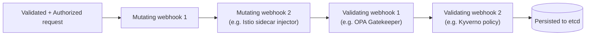

- **Mutating webhooks** run first and can modify the object (inject sidecars, set defaults, add labels).
- **Validating webhooks** run after mutation and can only accept/reject — used for policy-as-code enforcement (e.g., "no privileged containers", "images must come from approved registries").
- Built-in admission plugins include `NamespaceLifecycle`, `LimitRanger`, `ResourceQuota`, `PodSecurity`, `DefaultStorageClass`.

---

## 12. Cluster Bootstrap (How a Cluster Comes to Exist)

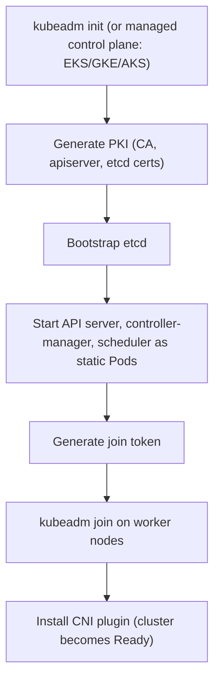

Managed offerings (EKS, GKE, AKS) automate/hide the control-plane bootstrap; self-managed clusters typically use `kubeadm`, `kops`, or `kubespray`.

---

## 13. Summary Table: Full Component Map

| Layer | Components |
|---|---|
| **Control Plane** | kube-apiserver, etcd, kube-scheduler, kube-controller-manager, cloud-controller-manager |
| **Node** | kubelet, kube-proxy, container runtime (containerd/CRI-O), CNI plugin, cAdvisor |
| **Networking** | Pod network (CNI), Services, Ingress, NetworkPolicy, CoreDNS |
| **Storage** | Volumes, PV, PVC, StorageClass, CSI drivers |
| **Workloads** | Pod, ReplicaSet, Deployment, StatefulSet, DaemonSet, Job, CronJob |
| **Config** | ConfigMap, Secret, Namespace |
| **Security** | Authentication, RBAC (Authorization), Admission Controllers, NetworkPolicy, PodSecurity |
| **Autoscaling** | HPA, VPA, Cluster Autoscaler |
| **Ecosystem** | Ingress Controller, Service Mesh, Metrics Server, Prometheus/Grafana, Operators/CRDs |

---

## 14. Key Takeaways

- Kubernetes is fundamentally a set of **independent control loops** reconciling desired vs. actual state, coordinated only through etcd via the API server.
- **Nothing talks to etcd except the API server** — this single choke point is what makes RBAC, admission control, and auditing possible.
- Kubernetes **delegates** networking (CNI), storage (CSI), and container execution (CRI) to pluggable interfaces rather than implementing them itself — this is why the ecosystem is so modular.
- Node-level failure handling (probes, eviction, PLEG) and cluster-level failure handling (Node controller, ReplicaSet controller) work at different layers but follow the same reconciliation philosophy.

> All diagrams use Mermaid syntax and render natively on GitHub/GitLab when this `.md` file is viewed in the repository.

---
# Kubernetes Architecture

Kubernetes follows a **master-worker (control plane / data plane)** architecture. A cluster consists of a **Control Plane** that makes global decisions about the cluster, and one or more **Worker Nodes** that run the actual application workloads.

---

## High-Level Diagram

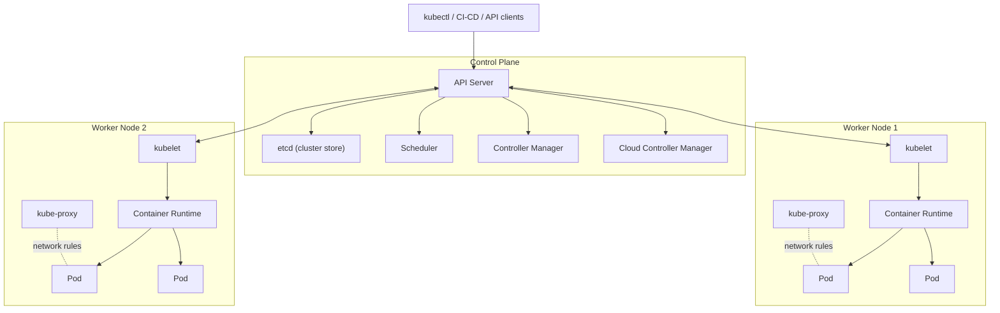

---

## 1. Control Plane Components

The control plane manages the overall state of the cluster: scheduling, scaling, and responding to cluster events.

| Component | Responsibility |
|---|---|
| **API Server** (`kube-apiserver`) | Front door to the cluster. Exposes the Kubernetes REST API. All communication (kubectl, controllers, kubelets) goes through it. |
| **etcd** | Consistent, highly-available key-value store. Holds all cluster state and configuration data. The single source of truth. |
| **Scheduler** (`kube-scheduler`) | Watches for newly created Pods with no assigned node, and picks a node for them to run on based on resource needs, constraints, and policies. |
| **Controller Manager** (`kube-controller-manager`) | Runs controller processes (Node controller, Replication controller, Endpoints controller, etc.) that continuously drive actual cluster state toward the desired state. |
| **Cloud Controller Manager** | Integrates with the underlying cloud provider (AWS, GCP, Azure) for things like load balancers, storage volumes, and node lifecycle. |

---

## 2. Worker Node Components

Worker nodes run the actual application containers, packaged inside Pods.

| Component | Responsibility |
|---|---|
| **kubelet** | Agent running on every node. Ensures containers described in PodSpecs are running and healthy. Talks to the API server. |
| **kube-proxy** | Maintains network rules on nodes, enabling network communication to Pods from inside or outside the cluster. |
| **Container Runtime** | Software responsible for actually running containers (e.g., containerd, CRI-O). |
| **Pod** | Smallest deployable unit in Kubernetes. Wraps one or more tightly-coupled containers that share network/storage. |

---

## 3. Core Objects & Abstractions

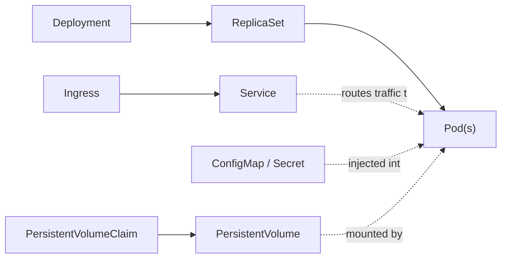

| Object | Purpose |
|---|---|
| **Pod** | Smallest unit; one or more containers sharing network/storage. |
| **ReplicaSet** | Ensures a specified number of Pod replicas are running at all times. |
| **Deployment** | Declarative way to manage ReplicaSets/Pods — supports rolling updates and rollbacks. |
| **Service** | Stable network endpoint (virtual IP/DNS name) that load-balances traffic across a set of Pods. |
| **Ingress** | Manages external HTTP/HTTPS access to Services, typically with routing rules and TLS. |
| **ConfigMap / Secret** | Externalized configuration and sensitive data injected into Pods. |
| **PersistentVolume (PV) / PersistentVolumeClaim (PVC)** | Abstraction for storage that outlives individual Pods. |
| **Namespace** | Virtual cluster within a cluster — used to divide resources between teams/environments. |

---

## 4. Request Flow Example

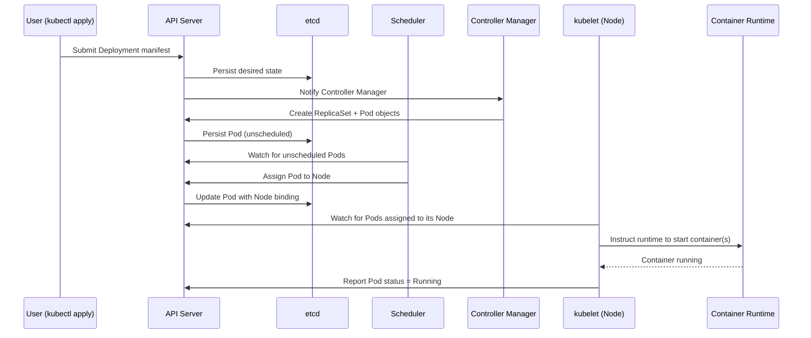

---

## 5. Summary

- **Control Plane** = brain of the cluster (API Server, etcd, Scheduler, Controller Manager, Cloud Controller Manager).
- **Worker Nodes** = muscle of the cluster (kubelet, kube-proxy, container runtime, Pods).
- Everything is **declarative**: you describe desired state, and controllers continuously reconcile actual state to match it.
- **etcd** is the single source of truth — losing it means losing the cluster's state.

> Note: GitHub and most modern Markdown renderers (including this file) support **Mermaid diagrams** natively in `.md` files — no extra plugins needed when viewed on GitHub.
