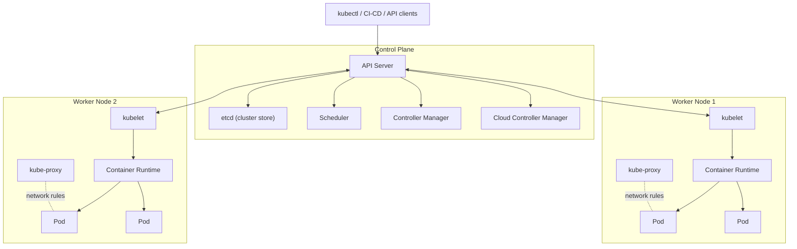
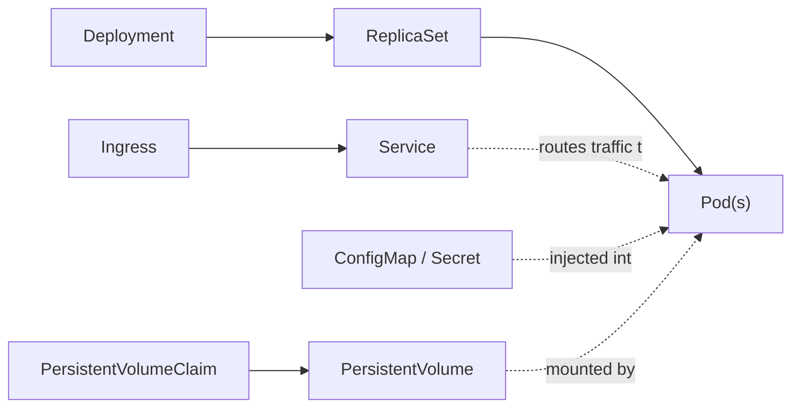
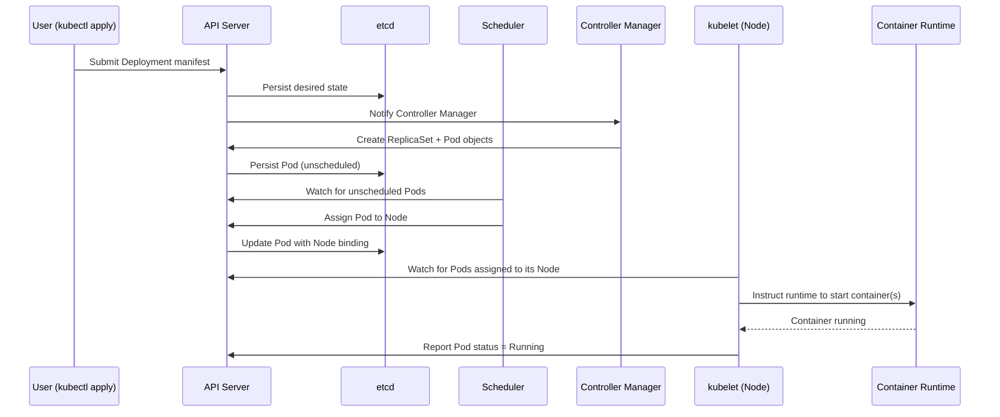

# Kubernetes Architecture

Kubernetes follows a **master-worker (control plane / data plane)** architecture. A cluster consists of a **Control Plane** that makes global decisions about the cluster, and one or more **Worker Nodes** that run the actual application workloads.

---

## High-Level Diagram

---

## 1. Control Plane Components

The control plane manages the overall state of the cluster: scheduling, scaling, and responding to cluster events.

| Component | Responsibility |
|---|---|
| **API Server** (`kube-apiserver`) | Front door to the cluster. Exposes the Kubernetes REST API. All communication (kubectl, controllers, kubelets) goes through it. |
| **etcd** | Consistent, highly-available key-value store. Holds all cluster state and configuration data. The single source of truth. |
| **Scheduler** (`kube-scheduler`) | Watches for newly created Pods with no assigned node, and picks a node for them to run on based on resource needs, constraints, and policies. |
| **Controller Manager** (`kube-controller-manager`) | Runs controller processes (Node controller, Replication controller, Endpoints controller, etc.) that continuously drive actual cluster state toward the desired state. |
| **Cloud Controller Manager** | Integrates with the underlying cloud provider (AWS, GCP, Azure) for things like load balancers, storage volumes, and node lifecycle. |

---

## 2. Worker Node Components

Worker nodes run the actual application containers, packaged inside Pods.

| Component | Responsibility |
|---|---|
| **kubelet** | Agent running on every node. Ensures containers described in PodSpecs are running and healthy. Talks to the API server. |
| **kube-proxy** | Maintains network rules on nodes, enabling network communication to Pods from inside or outside the cluster. |
| **Container Runtime** | Software responsible for actually running containers (e.g., containerd, CRI-O). |
| **Pod** | Smallest deployable unit in Kubernetes. Wraps one or more tightly-coupled containers that share network/storage. |

---

## 3. Core Objects & Abstractions

| Object | Purpose |
|---|---|
| **Pod** | Smallest unit; one or more containers sharing network/storage. |
| **ReplicaSet** | Ensures a specified number of Pod replicas are running at all times. |
| **Deployment** | Declarative way to manage ReplicaSets/Pods — supports rolling updates and rollbacks. |
| **Service** | Stable network endpoint (virtual IP/DNS name) that load-balances traffic across a set of Pods. |
| **Ingress** | Manages external HTTP/HTTPS access to Services, typically with routing rules and TLS. |
| **ConfigMap / Secret** | Externalized configuration and sensitive data injected into Pods. |
| **PersistentVolume (PV) / PersistentVolumeClaim (PVC)** | Abstraction for storage that outlives individual Pods. |
| **Namespace** | Virtual cluster within a cluster — used to divide resources between teams/environments. |

---

## 4. Request Flow Example

---

## 5. Summary

- **Control Plane** = brain of the cluster (API Server, etcd, Scheduler, Controller Manager, Cloud Controller Manager).
- **Worker Nodes** = muscle of the cluster (kubelet, kube-proxy, container runtime, Pods).
- Everything is **declarative**: you describe desired state, and controllers continuously reconcile actual state to match it.
- **etcd** is the single source of truth — losing it means losing the cluster's state.

> Note: GitHub and most modern Markdown renderers (including this file) support **Mermaid diagrams** natively in `.md` files — no extra plugins needed when viewed on GitHub.
